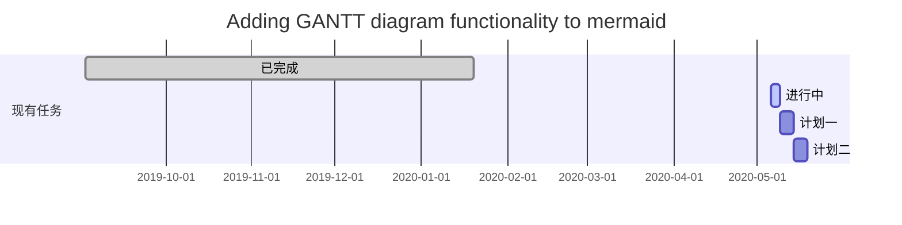
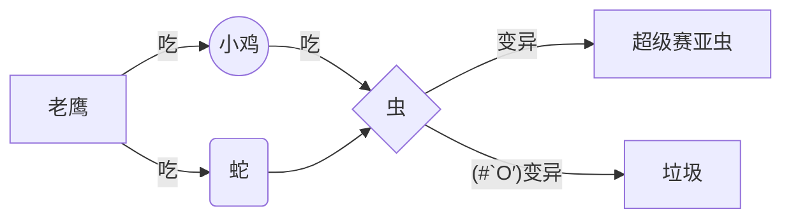
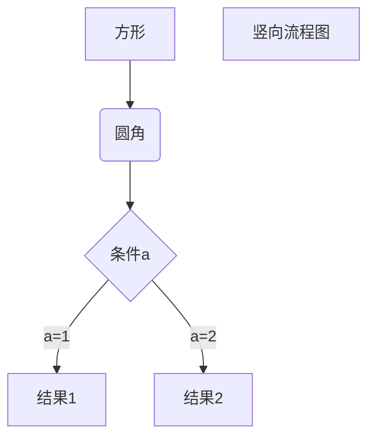
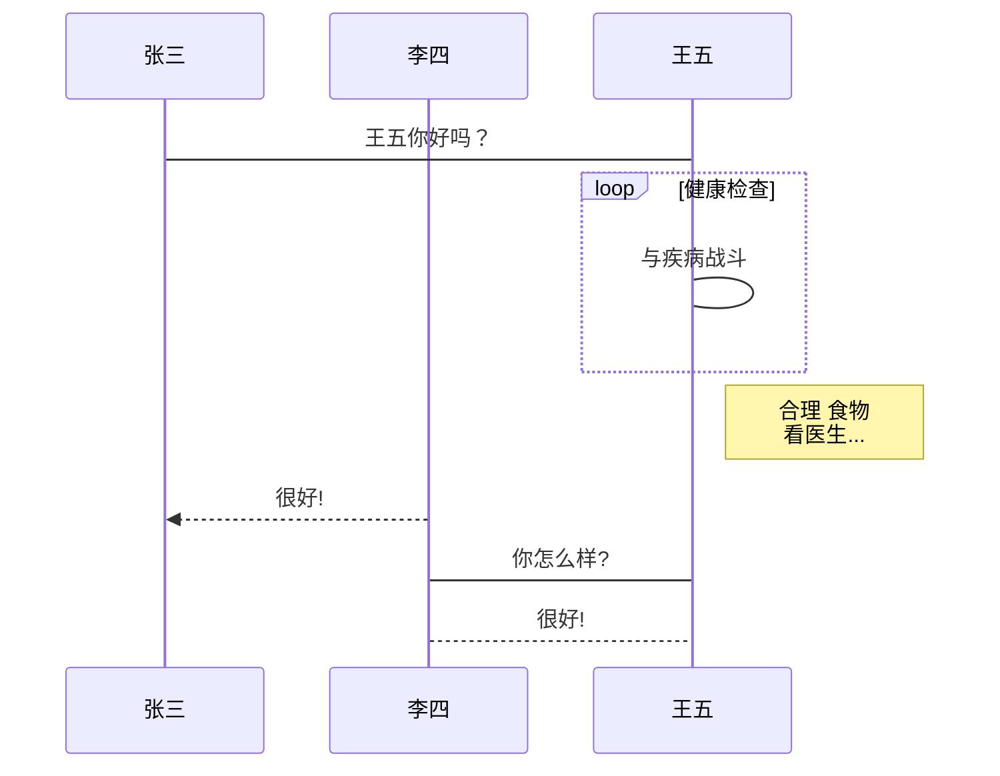
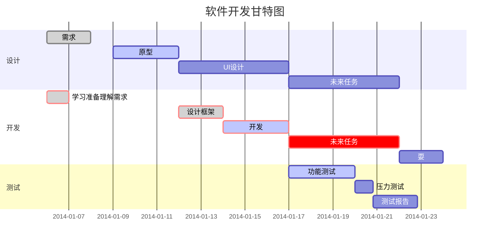

---
YAML FONT Matters
---


# Markdown语法学习


## 菜单

[TOC]


## Markdown标题语法

1.``#`` 表示标题，几个``#``表示标题几级，如：
####Heading level 4
2.文本下方添加任意数量的``==`` 号来标识一级标题，或者 ``--`` 号来标识二级标题，如：

`Heading level 1
==========`

`Heading level 2
-------`
**不同的 Markdown 应用程序处理 # 和标题之间的空格方式并不一致。为了兼容考虑，请用一个空格在 ``# ``和标题之间进行分隔

##Markdown 段落语法
要创建段落，请使用空白行将一行或多行文本进行分隔。

##Markdown 换行语法
在一行的末尾添加两个或多个空格，然后按回车键,即可创建一个换行``<br>``
``CommonMark`` 和其它几种轻量级标记语言支持在行尾添加反斜杠`` \ ``的方式实现换行，但是并非所有 Markdown 应用程序都支持此种方式，因此从兼容性的角度来看，不推荐使用
First line with the HTML tag after.<br>
And the next line

##Markdown 强调语法

### 1.粗体

在单词或短语的前后各添加两个星号（asterisks）``**``或下划线``__``（underscores）。如需加粗一个单词或短语的中间部分用以表示强调的话，请在要加粗部分的两侧各添加两个星号（asterisks）

I just love **bold text**.

###2. 斜体（Italic）

在单词或短语前后添加一个星号（asterisk）``**``或下划线``__``（underscore）

Italicized text is the *cat's meow*.

### 3. 粗体（Bold）和斜体（Italic）

在单词或短语的前后各添加三个星号或下划线。要加粗并用斜体显示单词或短语的中间部分，请在要突出显示的部分前后各添加三个星号，中间不要带空格。

This text is __*really important*__.

## Markdown 引用语法

要创建块引用，请在段落前添加一个 `>` 符号。按换行键换行，双按换行跳出

> 引用了哦，引用，引用。

####多个段落的块引用

块引用可以包含多个段落。为段落之间的空白行添加一个 `>` 符号。
> Dorothy followed her through many of the beautiful rooms in her castle.
>
> The Witch bade her clean the pots and kettles and sweep the floor and keep the fire fed with wood.

#### 嵌套块引用

块引用可以嵌套。在要嵌套的段落前添加一个 `>>` 符号
> Dorothy followed her through many of the beautiful rooms in her castle.
>
>> The Witch bade her clean the pots and kettles and sweep the floor and keep the fire fed with wood.

#### 带有其它元素的块引用

块引用可以包含其他 Markdown 格式的元素。并非所有元素都可以使用，你需要进行实验以查看哪些元素有效。
> #### The quarterly results look great!
>
> - Revenue was off the chart.
> - Profits were higher than ever.
>
>  *Everything* is going according to **plan**.

---------

## Markdown 列表语法

### 有序列表

在每个列表项前添加数字并紧跟一个英文句点。数字不必按数学顺序排列，但是列表应当以数字 1 起始。如：

1. First item

2. Second item

3. Third item

   1. Indented item

   2. Indented item

4. Fourth item

### 无序列表

在每个列表项前面添加破折号 (``-``)、星号 (``*``) 或加号 (``+``) 。缩进一个或多个列表项可创建嵌套列表。

- First item	

* First item

+ First item

- First item

### 在列表中嵌套其他元素

要在保留列表连续性的同时在列表中添加另一种元素，请将该元素缩进四个空格或一个制表符

* first item

  * > quote

* what

#### 代码块

* 代码块上方空出来一行	* 代码块左侧加8个空格或2个TAB(每一行都加)

1. 列表缩进
```html
列表中的代码块缩进
```
代码块后的缩进异常

1. 列表缩进
	```html
	列表中的代码块缩进
	```
	代码块后的缩进异常

#### 列表

1. First item
2. Second item
3. Third item
    - Indented item
    - Indented item
4. Fourth item

## Markdown 代码语法

要将单词或短语表示为代码，请将其包裹在反引号`` `中

At the command prompt, type `nano`.

### 转义反引号

如果你要表示为代码的单词或短语中包含一个或多个反引号，则可以通过将单词或短语包裹在双反引号(` `` `)中。

``Use `code` in your Markdown file.``

### 代码块

要创建代码块，请将代码块的每一行缩进至少四个空格或一个制表符。

    <html>
      <head>
      </head>
    </html>

## Markdown 分隔线语法

要创建分隔线，请在单独一行上使用三个或多个星号 (`***`)、破折号 (`---`) 或下划线 (`___`) ，并且不能包含其他内容。为了兼容性，请在分隔线的前后均添加空白行。

Try to put a blank line before...Without blank lines, this would be a heading.

---

...and after a horizontal rule.


-----


## Markdown 链接语法

链接文本放在中括号`[]`内，链接地址放在后面的括号`()`中，链接title可选。

相对路径也是可以的：一个小圆点`.`表示当前目录，两个小圆点`..`表示上一级目录

超链接Markdown语法代码：`[超链接显示名](超链接地址 "超链接title")`

对应的HTML代码：`<a href="超链接地址" title="超链接title">超链接显示名</a>`

​		这是一个链接 [Markdown语法](https://markdown.com.cn)。

### 给链接增加 Title

链接title是当鼠标悬停在链接上时会出现的文字，这个title是可选的，它放在圆括号中链接地址后面，跟链接地址之间以空格分隔。

这是一个链接 [Markdown语法](https://markdown.com.cn "恒神恒神你在哪")

### 网址和Email地址

使用尖括号可以很方便地把URL或者email地址变成可点击的链接。

<https://markdown.com.cn>
<fake@example.com>

### 带格式化的链接

[强调](https://markdown.com.cn/basic-syntax/links.html#emphasis) 链接, 在链接语法前后增加星号。 要将链接表示为代码，请在方括号中添加反引号

I love supporting the **[EFF](https://eff.org)**.`加两个✳`
This is the *[Markdown Guide](https://www.markdownguide.org)*.`加一个*`
See the section on [`code`](#code).

### 引用类型链接{#abc}

分为两部分：与文本保持内联的部分以及存储在文件中其他位置的部分，以使文本易于阅读。

不同的 Markdown 应用程序处理URL中间的空格方式不一样。为了兼容性，请尽量使用%20代替空格。

```text
这个链接用 1 作为网址变量 [Google][1].
这个链接用 yahoo 作为网址变量 [Yahoo!][yahoo].
然后在文档的结尾为变量赋值（网址）  
[1]: http://www.google.com/  
[yahoo]: http://www.yahoo.com/
```

#### 链接的第一部分格式

引用类型的链接的第一部分使用**两组括号**进行格式设置。第一组方括号包围应显示为链接的文本。第二组括号显示了一个标签，该标签用于指向您存储在文档其他位置的链接。

尽管不是必需的，可以在第一组和第二组括号之间包含一个空格。第二组括号中的标签不区分大小写，可以包含字母，数字，空格或标点符号。

示例：[名词][1]是什么

以下示例格式对于链接的第一部分效果相同：

- `[hobbit-hole][1]`
- `[hobbit-hole] [1]`

#### 链接的第二部分格式

[1]:https://en.wikipedia.org/wiki/Hobbit#Lifestyle
[1]: https://en.wikipedia.org/wiki/Hobbit#Lifestyle (Hobbit lifestyles)

引用类型链接的第二部分使用以下属性设置格式：

1. 放在括号中的标签，其后紧跟一个冒号和至少一个空格（例如`[label]:`）。
2. 链接的URL，可以选择将其括在尖括号中。
3. 链接的可选标题，可以将其括在双引号，单引号或括号中。

- `[1]: https://en.wikipedia.org/wiki/Hobbit#Lifestyle`
- `[1]: https://en.wikipedia.org/wiki/Hobbit#Lifestyle "Hobbit lifestyles"`
- `[1]: https://en.wikipedia.org/wiki/Hobbit#Lifestyle 'Hobbit lifestyles'`
- `[1]: https://en.wikipedia.org/wiki/Hobbit#Lifestyle (Hobbit lifestyles)`
- `[1]: <https://en.wikipedia.org/wiki/Hobbit#Lifestyle> "Hobbit lifestyles"`
- `[1]: <https://en.wikipedia.org/wiki/Hobbit#Lifestyle> 'Hobbit lifestyles'`
- `[1]: <https://en.wikipedia.org/wiki/Hobbit#Lifestyle> (Hobbit lifestyles)`


-----

## Markdown 图片语法

使用感叹号 (`!`), 然后在方括号增加替代文本，图片链接放在圆括号里，括号里的链接后可以增加一个可选的图片标题文本。

插入图片Markdown语法代码：``。

对应的HTML代码：``

.png "重阳")


### 链接图片

将图像的Markdown 括在方括号中，然后将链接添加在圆括号中。

[.png "重阳")](https://markdown.com.cn)

------------------------

## Markdown 转义字符语法

要显示原本用于格式化（粗体，斜体等） Markdown 文档的字符，在字符前面添加反斜杠字符 `\ `

以下列出的字符都可以通过使用反斜杠字符从而达到转义目的:

``\,\`,\*,\_,\{},\[],\(),\#,\+,\-,\.,\!,\| ``

###特殊字符自动转义

在 HTML 文件中，有两个字符需要特殊处理： `<` 和 `&` 。 `<` 符号用于起始标签，`&` 符号则用于标记 HTML 实体，如果你只是想要使用这些符号，你必须要使用实体的形式，像是 `<` 和 `&`。

Markdown 允许你直接使用这些符号，它帮你自动转义字符。如果你使用 `&` 符号的作为 HTML 实体的一部分，那么它不会被转换，而在其它情况下，它则会被转换成 `&`


____

## Markdown 内嵌 HTML 标签

对于 Markdown 涵盖范围之外的标签，都可以直接在文件里面用 HTML 本身。如需使用 HTML，不需要额外标注这是 HTML 或是 Markdown，只需 HTML 标签添加到 Markdown 文本中即可。

### 行级內联标签

HTML 的行级內联标签如 `<span>`、`<cite>`、`<del>` 不受限制，可以在 Markdown 的段落、列表或是标题里任意使用。依照个人习惯，甚至可以不用 Markdown 格式，而采用 HTML 标签来格式化。例如：如果比较喜欢 HTML 的 `<a>` 或 `` 标签，可以直接使用这些标签，而不用 Markdown 提供的链接或是图片语法。当你需要更改元素的属性时（例如为文本指定颜色或更改图像的宽度），使用 HTML 标签更方便些。

HTML 行级內联标签和区块标签不同，在內联标签的范围内， Markdown 的语法是可以解析的。如：

This **word** is bold. This <em>word</em> is italic.

### 区块标签

区块元素──比如 `<div>`、`<table>`、`<pre>`、`<p>` 等标签，必须在前后加上空行，以便于内容区分。而且这些元素的开始与结尾标签，不可以用 tab 或是空白来缩进。Markdown 会自动识别这区块元素，避免在区块标签前后加上没有必要的 `<p>` 标签

This is a regular paragraph.

<table>
    <tr>
        <td>Foo</td>
    </tr>
</table>

This is another regular paragraph.

请注意，Markdown 语法在 HTML 区块标签中将不会被进行处理。例如，你无法在 HTML 区块内使用 Markdown 形式的`*强调*`


-----


## Markdown 表格

要添加表，请使用三个或多个连字符（`---`）创建每列的标题，并使用管道（`|`）分隔每列。您可以选择在表的任一端添加管道。

```text
| Syntax      | Description |
| ----------- | ----------- |
| Header      | Title       |
| Paragraph   | Text        |
```

| Syntax    | Description |
| --------- | ----------- |
| Header    | Title       |
| Paragraph | Text        |

单元格宽度可以变化，如下所示。呈现的输出将看起来相同。

| Syntax    | Description |
| --------- | ----------- |
| Header    | Title       |
| Paragraph | Text        |

使用连字符和管道创建表可能很麻烦。为了加快该过程，使用图形界面构建表`Ctrl+T`

###  对齐

可以通过在标题行中的连字符的左侧，右侧或两侧添加冒号（`:`），将列中的文本对齐到左侧，右侧或中心。

```text
| Syntax      | Description | Test Text     |
| :---        |    :----:   |          ---: |
| Header      | Title       | Here's this   |
| Paragraph   | Text        | And more      |
```

| Syntax    | Description |   Test Text |
| :-------- | :---------: | ----------: |
| Header    |    Title    | Here's this |
| Paragraph |    Text     |    And more |

### 格式化表格中的文字

可以在表格中设置文本格式。例如，可以添加链接，代码（仅反引号（```）中的单词或短语，而不是代码块）和强调。不能添加标题，块引用，列表，水平规则，图像或HTML标签

### 在表中转义管道字符

可以使用表格的HTML字符代码（`|`）在表中显示竖线（`|`）字符

------

##  Markdown 围栏代码块

Markdown基本语法允许您通过将行缩进四个空格或一个制表符来创建[代码块](https://markdown.com.cn/basic-syntax/code-blocks.html)。如果发现不方便，请尝试使用受保护的代码块。根据Markdown处理器或编辑器的不同，在代码块之前和之后的行上使用三个反引号（(`` ``` ``）或三个波浪号（`~~~`）

### 语法高亮

在受防护的代码块之前的反引号旁边指定一种语言。

~~~text
```json
{
  "firstName": "John",
  "lastName": "Smith",
  "age": 25
}
```
~~~

----

##  Markdown 脚注

脚注使您可以添加注释和参考，而不会使文档正文混乱。当您创建脚注时，带有脚注的上标数字会出现在您添加脚注参考的位置。读者可以单击链接以跳至页面底部的脚注内容

要创建脚注参考，请在方括号（`[^1]`）内添加插入符号和标识符。标识符可以是数字或单词，但不能包含空格或制表符。标识符仅将脚注参考与脚注本身相关联-在输出中，脚注按顺序编号[^1]。

在括号内使用另一个插入符号和数字添加脚注，并用冒号和文本（`[^1]: My footnote.`）。脚注不必须放在文档末尾，可以将它们放在除列表，块和表之类的其他元素之外的任何位置.[^bignote]

[^1]: My footnote
[^bignote]:bignote.

> 区分[引用类型链接](#abc)


-------


##Markdown 标题编号

在 Markdown 中，添加指向标题的链接与添加普通链接的语法相同。只需要将网址替换为井号和标题的 ID。像这样：

```text
### My Great Heading {#custom-id}
## 标题文本 {#自定义ID}
```

My Great Heading {#123}

HTML看起来像这样：

```html
<h3 id="custom-id">My Great Heading</h3>
```

###链接到标题ID (#headid)

通过创建带有数字符号（`#`）和自定义标题ID的[标准链接](/basic-syntax/links.html)，可以链接到文件中具有自定义ID的标题。
```markdown
[链接文本][#标题ID]
```
[链接文本][#标题ID]
[Heading IDs](#123)

其他网站可以通过将自定义标题ID添加到网页的完整URL（例如`[Heading IDs](https://markdown.com.cn/extended-syntax/heading-ids.html#headid)`）来链接到标题:[Heading IDs](https://markdown.com.cn/extended-syntax/heading-ids.html#headid)

```markdown
[链接文本][URL#标题ID]
```

[链接文本][URL#标题ID]


--------


## Markdown 定义列表

定义列表用来定义术语和它的解释。要创建定义列表，第一行输入术语，第二行输入冒号和空格 `: `，紧跟着是解释，也可以是多段解释。

<dl>
  <dt>First Term</dt>
  <dd>This is the definition of the first term.</dd>
  <dt>Second Term</dt>
  <dd>This is one definition of the second term. </dd>
  <dd>This is another definition of the second term.</dd>
</dl>
```markdown
术语名称
: 术语定义
: 术语的第二定义（如果有）
```


-----

## markdown 删除线

要删除单词，请在单词前后使用两个波浪号`~~`。

```text
~~世界是平坦的。~~ 我们现在知道世界是圆的。
```

~~世界是平坦的。~~ 我们现在知道世界是圆的。

-----

## Markdown 任务列表语法

创建任务列表，在任务列表项之前添加破折号`-`和方括号`[ ]`，并在`[ ]`前面加上空格。要选择一个复选框，请在方括号`[x]`之间添

```text
- [x] Write the press release
- [ ] Update the website
- [ ] Contact the media
```

- [ ] Write the press release
- [ ] Update the website
- [ ] Contact the media

------


## Markdown 使用 Emoji 表情

允许通过键入表情符号短代码来插入表情符号。这些以冒号开头和结尾，并包含表情符号的名称。

```text
去露营了！ :tent: 很快回来。
真好笑！ :joy:
```

去露营了！ :tent: 很快回来。

真好笑！ :joy:

-----

## 自动网址链接

如果输入[http://www.example.com](http://www.example.com/)，即使未[使用方括号](https://markdown.com.cn/basic-syntax/links.html)，Markdown处理器也会自动将其转换为链接。

如果不希望自动链接URL，则可以通过将URL表示为带反引号的代码来删除该链接。

`http://www.example.com`

-----

## Typora 公式&数学

###插入数学公式

在Typora中，有两种方法插入数学公式，语法为：

第一种方法：`$$回车$$`

第二种方法：【右键插入公式】数学公式

### 上标下标

上下标可以使用`^` `-`后跟相应符号实现

### 根号

使用`\sqrt{}`来表示:	$\sqrt{t}$

### 上下水平线

可以使用`\underline{}`,`\overline{}`来表示上下水平线：$\underline{a+b}$

### 上下水平大括号

可以使用`\overbrace{}`,`\underbrace{}`来表示上下水平大括号：$\overbrace{x_1+x_2}$

### 向量符号

可以使用`\vec{}`来表示单个字母向量（也可多个，但不美观），`\overrightarrow{}`和`\overleftarrow{}`在定义从A到B的向量时非常有用。

$\vec{a}$,$\vec{ABC}$,$\overrightarrow{ABC}$,$\overleftarrow{ABC}$

### 分数

可以使用`\frac{}{}`来表示分数：$\frac{1}{2}$,$\frac{\sqrt{3}}{4}$

### 积分运算符

用`\int`来生成，用`\int_{}^{}`来表示积分上下界，如：$\int$,$\int_{1}^{2}$

### 求和运算符

可以用`\sum`来生成，用`\sum_{}^{}`表示求和上下界

### 连乘运算符

可以用`\prod{}`来表示，同样，上下标用`\prod_{}^{}`来表示。$\prod$ ， $\prod_{i=1}^{10}x_i$

### 特殊符号  $\LaTeX$

#### 希腊字母:$	\alpha$,$\beta$,$\gamma$,$\theta,\Theta$,$\rho$,$\lambda,\Lambda$,$\mu$,$\delta,\Delta$,$\pi,\Pi$,$\omega,\Omega$,$\epsilon,\zeta,\eta,\xi,\Xi,\omicron,\Sigma,\sigma,\Upsilon,\tau,\phi,\Phi,\chi,\psi,\Psi,\rho,\mu$

#### 关系运算符：

大于等于：`\geq`或`\ge`$\geq$  ,  小于等于：`\leq`或`le`$\le$,不等于`\neq`$\neq$

乘：`\times`$\times$  ,   除：`\div`$\div$  ,微分：`\partial`$\partial$

a点b：`a\cdot b`$a\cdot b$    ，a星b：`a\ast b`$a\ast b$

`$\sin(x),\cos(x),\tan(x),\log_3 10,\ln2$`$\sin(x),\cos(x),\tan(x),\log_3 10,\ln2$

`$\infty,\vea{a},\dot{a},\ddot{a},\sum_0^3,\bar{a},\hat{a},\overline{xyz},\sqrt x,\sqrt[a]{b},\lim{a+b},\lim{n\rightarrow+\infty},\sum^{x\to\infty}_{y\to 0}{\frac{x}{y}},(a b cd e fg h i)$`

$\infty,\vec{a},\dot{a},\ddot{a},\sum_0^3,\bar{a},\hat{a},\overline{xyz},\sqrt x,\sqrt[a]{b},\lim{a+b},\lim{n\rightarrow+\infty},\sum^{x\to\infty}_{y\to 0}{\frac{x}{y}},(a b c d e f g h i)$

#### 集合运算符

`\in,\notin`,`\subset,\supset,\subseteq,\supseteq`,`\cup,\cap,\setminus`,`\bigodot,\bigoplus`

$\in,\notin,\subset,\supset,\subseteq,\supseteq,\cup,\cap,\setminus,\bigodot,\bigoplus$

### 矩阵

`\bigin{matrix}`和`\end{matrix}`说明在它们之间的是矩阵,其中用&来分割每一个元素，用\\来换行

$\begin{matrix}    1&2&3\\4&5&6  \end{matrix}$


----


##Typora画图

### 甘特图



### 流程图

####横向流程图



#### 竖向流程图



####标准流程图源码格式：

```flow
st=>start: 开始框
op=>operation: 处理框
cond=>condition: 判断框(是或否?)
sub1=>subroutine: 子流程
io=>inputoutput: 输入输出框
e=>end: 结束框
st->op->cond
cond(yes)->io->e
cond(no)->sub1(right)->op
```

标准流程图源码格式（横向）：

```flow
st=>start: 开始框
op=>operation: 处理框
cond=>condition: 判断框(是或否?)
sub1=>subroutine: 子流程
io=>inputoutput: 输入输出框
e=>end: 结束框

st(right)->op(right)->cond
cond(yes)->io(bottom)->e
cond(no)->sub1(right)->op
```

####UML时序图源码样例：

```sequence
对象A->对象B: 对象B你好吗?（请求）

Note right of 对象B: 对象B的描述
Note left of 对象A: 对象A的描述(提示)

对象B-->对象A: 我很好(响应)
对象A->对象B: 你真的好吗？
```
####UML时序图源码复杂样例：

```sequence
Title: 标题：复杂使用
对象A->对象B: 对象B你好吗?（请求）

Note right of 对象B: 对象B的描述
Note left of 对象A: 对象A的描述(提示)

对象B-->对象A: 我很好(响应)
对象B->小三: 你好吗
小三-->>对象A: 对象B找我了
对象A->对象B: 你真的好吗？

Note over 小三,对象B: 我们是朋友
participant C
Note right of C: 没人陪我玩
```
UML标准时序图样例：


####甘特图样例：




## 文本居中

```
\<center\>这是要居中的文本内容\</center\>
<div align = "center">这里输入要居中改的字体</div>
```

<center>这是要居中的文本内容</center>

<div align = "center">这里输入要居中改的字体</div>

##Typora快捷键

#### 文本编辑快捷键

- 加粗： `Ctrl + B`
- 撤销： `Ctrl + Z`
- 字体倾斜 ：`Ctrl+I`
- 下划线：`Ctrl+U`
- [多级标题](https://zhida.zhihu.com/search?q=多级标题&zhida_source=entity&is_preview=1)： `Ctrl + 1~6`
- 有序列表：`Ctrl + Shift + [`
- 无序列表：`Ctrl + Shift + ]`
- 降级快捷键 ：`Tab`
- 升级快捷键：`Shift + Tab`
- 插入链接： `Ctrl + K`
- 插入公式： `Ctrl + Shift + M`
- 行内代码： `Ctrl + Shift + K`
- 插入图片： `Ctrl + Shift + I`
- 返回Typora顶部：`Ctrl+Home`
- 返回Typora底部 ：`Ctrl+End`
- 创建表格 ：`Ctrl+T`
- 选中某句话 ：`Ctrl+L`
- 选中某个单词 ：`Ctrl+D`
- 选中相同格式的文字 ：`Ctrl+E`
- 搜索: `Ctrl+F`
- 搜索并替换 ：`Ctrl+H`
- 删除线 ：`Alt+Shift+5`
- 引用 ：`Ctrl+Shift+Q`
- 生成目录：`[TOC]+Enter`

注：一些实体符号需要在实体符号之前加” \ ”才能够显示

####编辑模式快捷键

- 源码模式编辑切换：`ctrl + /`
- 打字机模式切换：`F9`
- 专注模式切换：`F8`
- 全屏模式切换：`F11`
- Typora内部窗口焦点切换：`ctrl + tab`
- 侧边栏显示/隐藏切换：`ctrl + shift + L`

## 其他

###区域元素

在文章的**最上方**输入---，按换行键产生，然后在里面输入内容即可。

### 段落

按换行键[Enter]建立新的一行,按`Shift`+`Enter`可以创建一个比段落间距**更小**的行间距。可在行尾插入打断线，禁止向后插入

```text
打断线<br/>后面的内容将自动换行
```

#### 删除线：

开头`~~`，结尾`~~`。

#### 下划线：

使用HTML标签`<u>下划线</u>`, <u>下划线</u>

#### 高亮：

`==内容==`，需要自己在偏好设置里面打开这项功能 ==123==

#### 数学式：

打开Typora选择数学模块

- 点击“段落”—>“公式块”

- 快捷键Ctrl+Shift+m

- `“$$”+回车`

  以上三种方式都能打开数学公式的编辑栏。`输入$，然后按ESC键，之后输入Tex命令，可预览`

==下标==:使用~~括住内容。需要自己在偏好设置里面打开这项功能H~2~O

==上标==:使用^括住内容。需要自己在偏好设置里面打开这项功能

## 论文封面模板

<div class="cover" style="page-break-after:always;font-family:方正公文仿宋;width:100%;height:100%;border:none;margin: 0 auto;text-align:center;">
    <div style="width:60%;margin: 0 auto;height:0;padding-bottom:10%;">
        </br>
        
    </div>
    </br></br></br></br></br>
    <div style="width:60%;margin: 0 auto;height:0;padding-bottom:40%;">
        
	</div>
    </br></br></br></br></br></br></br></br>
    <span style="font-family:华文黑体Bold;text-align:center;font-size:20pt;margin: 10pt auto;line-height:30pt;">《论文名称》</span>
    <p style="text-align:center;font-size:14pt;margin: 0 auto">论文类型 </p>
    </br>
    </br>
    <table style="border:none;text-align:center;width:72%;font-family:仿宋;font-size:14px; margin: 0 auto;">
    <tbody style="font-family:方正公文仿宋;font-size:12pt;">
    	<tr style="font-weight:normal;"> 
    		<td style="width:20%;text-align:right;">题　　目</td>
    		<td style="width:2%">：</td> 
    		<td style="width:40%;font-weight:normal;border-bottom: 1px solid;text-align:center;font-family:华文仿宋"> 论文题目</td>     </tr>
    	<tr style="font-weight:normal;"> 
    		<td style="width:20%;text-align:right;">上课时间</td>
    		<td style="width:2%">：</td> 
    		<td style="width:40%;font-weight:normal;border-bottom: 1px solid;text-align:center;font-family:华文仿宋"> 上课时间</td>     </tr>
    	<tr style="font-weight:normal;"> 
    		<td style="width:20%;text-align:right;">授课教师</td>
    		<td style="width:2%">：</td> 
    		<td style="width:40%;font-weight:normal;border-bottom: 1px solid;text-align:center;font-family:华文仿宋">教师姓名 </td>     </tr>
    	<tr style="font-weight:normal;"> 
    		<td style="width:20%;text-align:right;">姓　　名</td>
    		<td style="width:2%">：</td> 
    		<td style="width:40%;font-weight:normal;border-bottom: 1px solid;text-align:center;font-family:华文仿宋"> 你的名字</td>     </tr>
    	<tr style="font-weight:normal;"> 
    		<td style="width:20%;text-align:right;">学　　号</td>
    		<td style="width:2%">：</td> 
    		<td style="width:40%;font-weight:normal;border-bottom: 1px solid;text-align:center;font-family:华文仿宋">你的学号 </td>     </tr>
    	<tr style="font-weight:normal;"> 
    		<td style="width:20%;text-align:right;">组　　别</td>
    		<td style="width:%">：</td> 
    		<td style="width:40%;font-weight:normal;border-bottom: 1px solid;text-align:center;font-family:华文仿宋"> 你的组别</td>     </tr>
    	<tr style="font-weight:normal;"> 
    		<td style="width:20%;text-align:right;">日　　期</td>
    		<td style="width:2%">：</td> 
    		<td style="width:40%;font-weight:normal;border-bottom: 1px solid;text-align:center;font-family:华文仿宋">完成日期</td>     </tr>
    </tbody>              
    </table>
</div>

<div class="cover" style="page-break-after:always;font-family:方正公文仿宋;width:100%;height:100%;border:none;margin: 0 auto;text-align:center;">
    <div style="width:60%;margin: 0 auto;height:0;padding-bottom:10%;">
    </br>
        
    </div>
</br></br></br>
    <div style="width:65%;margin: 0 auto;height:0;padding-bottom:40%;">
        
	</div>
    </br></br></br></br></br></br></br>
    <span style="font-family:华文黑体Bold;text-align:center;font-size:20pt;margin: 10pt auto;line-height:30pt;">《论文名称》</span>
    <p style="text-align:center;font-size:14pt;margin: 0 auto">论文类型 </p>
    </br>
    </br>
    <table style="border:none;text-align:center;width:72%;font-family:仿宋;font-size:14px; margin: 0 auto;">
    <tbody style="font-family:方正公文仿宋;font-size:12pt;">
    	<tr style="font-weight:normal;"> 
    		<td style="width:20%;text-align:right;">题　　目</td>
    		<td style="width:2%">：</td> 
    		<td style="width:40%;font-weight:normal;border-bottom: 1px solid;text-align:center;font-family:华文仿宋"> 论文题目</td>     </tr>
    	<tr style="font-weight:normal;"> 
    		<td style="width:20%;text-align:right;">上课时间</td>
    		<td style="width:2%">：</td> 
    		<td style="width:40%;font-weight:normal;border-bottom: 1px solid;text-align:center;font-family:华文仿宋"> 上课时间</td>     </tr>
    	<tr style="font-weight:normal;"> 
    		<td style="width:20%;text-align:right;">授课教师</td>
    		<td style="width:2%">：</td> 
    		<td style="width:40%;font-weight:normal;border-bottom: 1px solid;text-align:center;font-family:华文仿宋">教师姓名 </td>     </tr>
    	<tr style="font-weight:normal;"> 
    		<td style="width:20%;text-align:right;">姓　　名</td>
    		<td style="width:2%">：</td> 
    		<td style="width:40%;font-weight:normal;border-bottom: 1px solid;text-align:center;font-family:华文仿宋"> 你的名字</td>     </tr>
    	<tr style="font-weight:normal;"> 
    		<td style="width:20%;text-align:right;">学　　号</td>
    		<td style="width:2%">：</td> 
    		<td style="width:40%;font-weight:normal;border-bottom: 1px solid;text-align:center;font-family:华文仿宋">你的学号 </td>     </tr>
    	<tr style="font-weight:normal;"> 
    		<td style="width:20%;text-align:right;">组　　别</td>
    		<td style="width:%">：</td> 
    		<td style="width:40%;font-weight:normal;border-bottom: 1px solid;text-align:center;font-family:华文仿宋"> 你的组别</td>     </tr>
    	<tr style="font-weight:normal;"> 
    		<td style="width:20%;text-align:right;">日　　期</td>
    		<td style="width:2%">：</td> 
    		<td style="width:40%;font-weight:normal;border-bottom: 1px solid;text-align:center;font-family:华文仿宋">完成日期</td>     </tr>
    </tbody>              
    </table>
</div>
